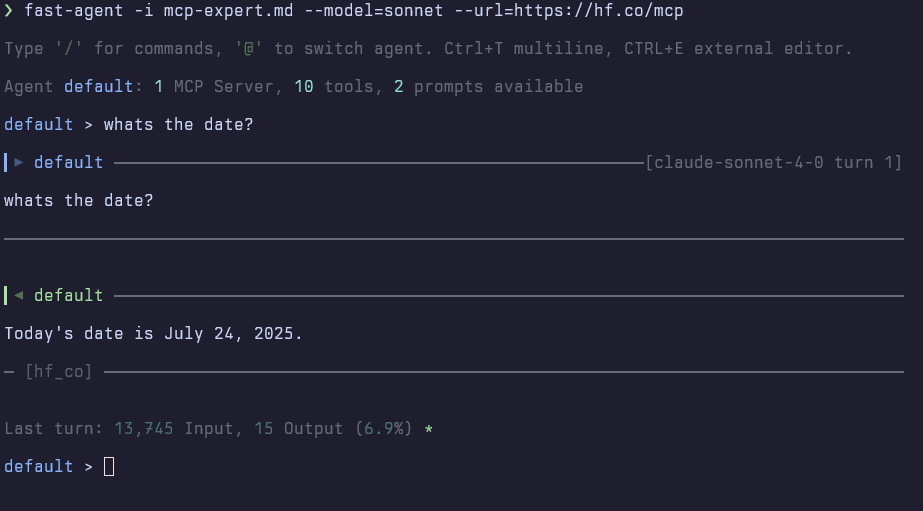
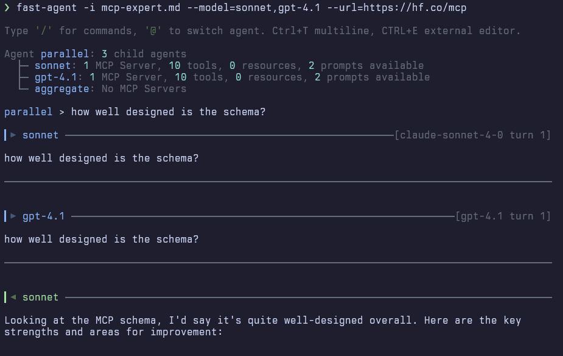

# System Prompts

Agents can have their System Instructions set and customised in a number of flexible ways. The default System Prompt caters or Agent Skills, MCP Server Instructions, `AGENTS.md` and Shell access.

## Template Variables

The following variables are available in System Prompt templates:

| Variable | Description |  Notes |
|----------|-------------|-------|
| <nobr>`{{file:path}}`</nobr> | Reads and embeds local file contents (errors if file missing) |  **Must be a relative path** (resolved relative to `workspaceRoot`) |
| <nobr>`{{file_silent:path}}`</nobr> | Reads and embeds local file contents (empty if file missing) |  **Must be a relative path** (resolved relative to `workspaceRoot`) |
| <nobr>`{{url:https://...}}`</nobr> | Fetches and embeds content from a URL |
| <nobr>`{{serverInstructions}}`</nobr> | MCP server instructions with available tools |  Warning displayed in `/mcp` if Instructions are present and template variable missing |
| <nobr>`{{agentSkills}}`</nobr> | Agent skill manifests with descriptions |  |
| <nobr>`{{workspaceRoot}}`</nobr> | Current working directory / workspace root | Set by Client in ACP Mode |
| <nobr>`{{hostPlatform}}`</nobr> | Host platform information | `Linux-6.6.87.2-microsoft-standard-WSL2` |
| <nobr>`{{pythonVer}}`</nobr> | Python version | `3.11.0` |
| <nobr>`{{env}}`</nobr> | Formatted environment block with all environment details |  |
| <nobr>`{{currentDate}}`</nobr> | Current date in long format |  |

**Example `{{env}}` output:**
```
Environment:
- Workspace root: /home/user/project
- Client: Zed 0.232
- Host platform: Linux-6.6.87.2-microsoft-standard-WSL2
```

**Note on file templates:** File paths in `{{file:...}}` and `{{file_silent:...}}` must be relative paths. They will be resolved relative to the `workspaceRoot` at runtime. Absolute paths are not allowed and will raise an error.

**Viewing the System Prompt** The System Prompt can be inspected with the `/system` command from `fast-agent` or the `/status 
system` Slash Command in ACP Mode.

The default System Prompt used with `fast-agent go` or `fast-agent-acp` is:

```markdown
You are a helpful AI Agent.

{{serverInstructions}}
{{agentSkills}}
{{file_silent:AGENTS.md}}
{{env}}

The current date is {{currentDate}}."""
```


## Using Instructions

When defining an Agent, you can load the instruction as either a `String`, `Path` or `AnyUrl`.

Instructions support embedding the current date, as well as content from other URLs. This is really helpful if you want to refer to files on GitHub, or assemble useful prompts/content in Gists etc.

```python title="Simple String"
@fast.agent(name="example",
    instruction="""
You are a helpful AI Agent.
""")
```

```python title="With current date"
@fast.agent(name="example",
    instruction="""
You are a helpful AI Agent.
Your reliable knowledge cut-off date is December 2024.
Todays date is {{currentDate}}.
""")
```

Will produce: `You are a helpful AI Agent. Your reliable knowledge cut-off date is December 2024. Todays date is 25 July 2025.`

```python title="With URL"
@fast.agent(name="mcp-expert",
    instruction="""
You are have expert knowledge of the
MCP (Model Context Protocol) schema.

{{url:https://raw.githubusercontent.com/modelcontextprotocol/modelcontextprotocol/refs/heads/main/schema/2025-06-18/schema.ts}}

Answer any questions about the protocol by referring
to and quoting the schema where necessary.
""")
```

You can store the prompt in an external file for easy editing - including template variables:

```python title="From file"
from pathlib import Path

@fast.agent(name="mcp-expert",
    instruction=Path("./mcp-expert.md"))
""")
```

```md title="mcp-expert.md"
You are have expert knowledge of the MCP (Model Context Protocol) schema.

{{url:https://raw.githubusercontent.com/modelcontextprotocol/modelcontextprotocol/refs/heads/main/schema/2025-06-18/schema.ts}}

Answer any questions about the protocol by referring to and quoting the schema where necessary.
Your knowledge cut-off is December 2024, todays date is {{currentDate}}

```

Or you can load the prompt directly from a URL:

```python title="From URL"
from pydantic import AnyUrl

@fast.agent(name="mcp-expert",
    instruction=AnyUrl("https://gist.githubusercontent.com/evalstate/d432921aaaee2c305cf46ae320840360/raw/eb9c7ff93adc780171bfb0ae2560be2178304f16/gistfile1.txt"))

# --> fast-agent system prompt demo
```

You can start an agent with instructions from a file using the `fast-agent` commmand:

```bash
fast-agent --instructions mcp-expert.md
fast-agent -i mcp-expert.md
```

This can be combined with other options to specify model and available servers:

```bash
fast-agent -i mcp-expert.md --model sonnet --url https://hf.co/mcp
```

Starts an interactive agent session, with the MCP Schema loaded, attached to Sonnet with the Hugging Face MCP Server.



You can even specify multiple models to directly compare their outputs:



Read more about the `fast-agent` command [here](../ref/go_command.md).
