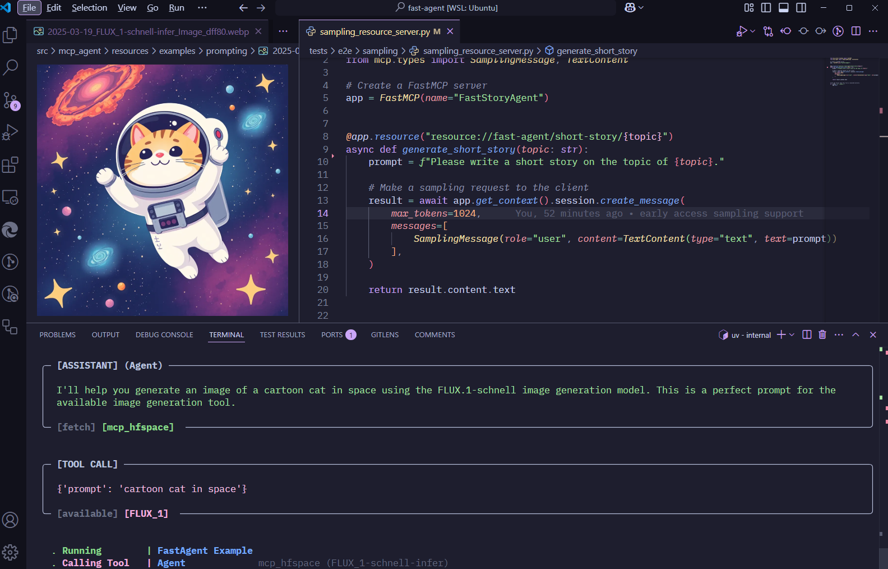

# welcome to fast-agent

## Get Started

* `uv pip install fast-agent-mcp` - Install fast-agent.
* `fast-agent setup` - Create Agent and Configuration files.
* `uv run agent.py` - Run your first Agent
* `fast-agent bootstrap workflow` - Create Agent workflow examples

{ align=left }
