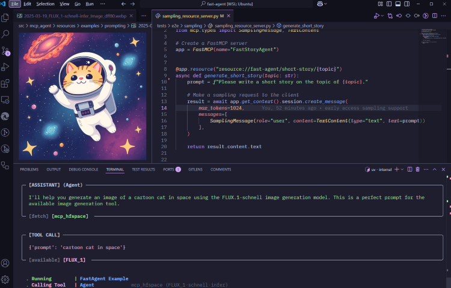

<div class="grid cards" markdown>
-   :material-clock-fast:{ .lg .middle } __Start now__

    ---

    Run with the [uv](https://astral.sh/uv package manager now:

    ```
    uvx fast-agent-mcp@latest -x
    ```
    

    <!-- [:octicons-arrow-right-24: Get started](#get-started) -->


-   :material-battery-charging:{ .lg .middle } __Agent Skills__

    ---

    Support for [Agent Skills](https://www.anthropic.com/engineering/equipping-agents-for-the-real-world-with-agent-skills) to define context efficient behaviour for your Agents. Read the documentation [here](./agents/skills.md).

-   :material-connection:{ .lg .middle } __New - Elicitation Quickstart Guide__

    ---

    Get started with MCP Elicitations for User Interaction. 
    [:octicons-arrow-right-24: Try now](./mcp/elicitations.md)

-   :material-beaker-check-outline:{ .lg .middle } __Validated Model Support__

    ---

    Advanced [support](./models/llm_providers.md) for models including OpenAI, Anthropic, Hugging Face, llama.cpp and more. Bring your Codex OAuth token.


-   :material-check-all:{ .lg .middle } __MCP Feature Support__

    ---

    Full MCP feature support including Elicitation and Sampling and advanced transport diagnostics

    [:octicons-arrow-right-24: Reference](mcp/index.md)

-   :material-application-braces-outline:{ .lg .middle } __Agent Developer Friendly__

    ---

    Lightweight deployment - in-built Echo and Playback LLMs allow robust agent application testing


</div>

<center>
## Getting Started
</center>
<br />
<div class="grid" markdown>
<div align="top" markdown>
**fast-agent** lets you create and interact with sophisticated Agents and Workflows in minutes. It's multi-modal - supporting Images and PDFs in Prompts, Resources and MCP Tool Call results.  

Prebuilt agents and examples implementing the patterns in Anthropic's [building effective agents](https://www.anthropic.com/engineering/building-effective-agents) paper get you building valuable applications quickly. Seamlessly use MCP Servers with your agents, or host your agents as MCP Servers.

* `uv tool install fast-agent-mcp` - Install fast-agent. If you have multiple Python versions, use `--python 3.13.5` to ensure you get the latest version of fast-agent.
* `fast-agent go` - Start an interactive session...
* `fast-agent go --url https://hf.co/mcp` - ...with a remote MCP.
* `fast-agent go --pack analyst --model haiku` - ...from an installed or marketplace card pack.
* `fast-agent scaffold` - Create Agent and Configuration files.
* `uv run agent.py` - Run your first Agent
* `fast-agent quickstart workflow` - Create Agent workflow examples

Contributing to docs? See [Generated Docs](./ref/generated_docs.md) for how to regenerate reference tables and includes.
</div>
<div markdown>
<!--[Welcome Image](welcome_small.png)-->

</div>
</div>

