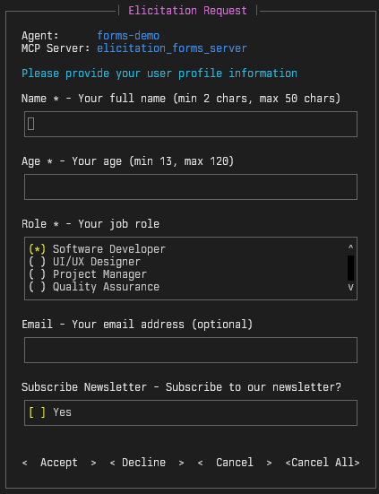
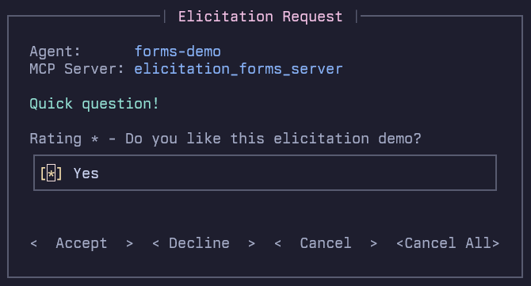

# Quick Start: MCP Elicitations

In this quick start, we'll demonstrate **fast-agent**'s [MCP Elicitation](https://modelcontextprotocol.io/specification/2025-06-18/client/elicitation) features.

{: align=right style="width:250px;"  }

Elicitations allow MCP Servers to request additional information from Users whilst they are running.

The demo comprises three MCP Servers and three **fast-agent** programs:

 - An interactive demonstration showing different types of Forms, Fields and Validation.
 - A demonstration of an Elicitation made during a Tool Call.
 - An example of using a custom Elicitation handler.

This quick start gives provides you with a complete MCP Client and Server solution for developing and deploying Elicitations.  

## Setup **fast-agent**

Make sure you have the `uv` [package manager](https://docs.astral.sh/uv/) installed, and open a terminal window. Then:

=== "Linux/MacOS"

    ```bash
    # create, and change to a new directory
    mkdir fast-agent && cd fast-agent

    # create and activate a python environment
    uv venv
    source .venv/bin/activate

    # setup fast-agent
    uv pip install fast-agent-mcp

    # setup the elicitations demo 
    fast-agent quickstart elicitations

    # go the demo folder
    cd elicitations
    ```
=== "Windows"

    ```pwsh
    # create, and change to a new directory
    md fast-agent |cd

    # create and activate a python environment
    uv venv
    .venv\Scripts\activate

    # setup fast-agent
    uv pip install fast-agent-mcp

    # setup the elicitations demo 
    fast-agent quickstart elicitations

    # go the demo folder
    cd elicitations
    ```

You are now ready to start the demos.

## Elicitation Requests and Forms

The Interactive Forms demo showcases all of the Elicitation data types and validations. Start the interactive form demo with:

```bash
uv run forms_demo.py
```

This demonstration displays 4 different elicitation forms in sequence.

Note that the forms:

 - Can be navigated with the `Tab` or Arrow Keys (`→\←`)
 - Have real time Validation
 - Can be Cancelled with the Escape key
 - Uses multiline text input for long fields
 - Identify the Agent and MCP Server that produced the request.
 

{: align=right style="width:350px;"  }

The `Cancel All` option cancels the Elicitation Request, and automatically cancels future requests to avoid unwanted interruptions from badly behaving Servers.

For MCP Server developers, the form is fast and easy to navigate to facilitating iterative development. 

The `elicitation_forms_server.py` file includes examples of all field types and validations: `Numbers`, `Booleans`, `Enums` and `Strings`.

It also supports the formats specified in the [schema](https://github.com/modelcontextprotocol/modelcontextprotocol/blob/b98f9805e963af7f67f158bdfa760078be4675a3/schema/2025-06-18/schema.ts#L1335-L1342): `Email`, `Uri`, `Date` and `Date/Time`.


## Tool Call

The Tool Call demo demonstrates an Elicitation being conducted during an MCP Tool Call. This also showcases a couple of **fast-agent** features:

- The `passthrough` model supports testing without an LLM. You can read more about Internal Models [here](/models/internal_models/).
- Calling a tool by sending a `***CALL_TOOL` message, that enables an Agent to directly call an MCP Server Tool with specific arguments.

Run `uv run tool_call.py` to run the Agent and see the elicitation. You can use a real LLM with the `--model` switch.

## Custom Handler

This example shows how to write and integrate a custom Elicitation handler. For this example, the agent uses a custom handler to generate a character for a game. To run:

```bash
uv run game_character.py
```


This agent uses a custom elicitation handler to generate a character for a game. The custom handler is in `game_character_handler.py` and is setup with the following code:

```python title="game_character.py" linenums="23" hl_lines="4-5"
@fast.agent(
    "character-creator",
    servers=["elicitation_forms_server"],
    # Register our handler from game_character_handler.py
    elicitation_handler=game_character_elicitation_handler,
)
```

For MCP Server Developers, Custom Handlers can be used to help complete automated test flows. For Production use, Custom Handlers can be used to send notifications or request input via remote  platforms such as web forms.

## Configuration

Note that Elicitations are now _enabled by default_ in **fast-agent**, and can be [configured with](/mcp/#elicitations) the `fastagent.config.yaml` file. 

You can configure the Elicitation mode to `forms` (the default),`auto-cancel` or `none`. 

```yaml title="fastagent.config.yaml" linenums="19" hl_lines="10"
mcp:
  servers:
    # Elicitation test servers for different modes
    elicitation_forms_mode:
      command: "uv"
      args: ["run", "elicitation_test_server_advanced.py"]
      transport: "stdio"
      cwd: "."
      elicitation:
        mode: "forms"

```

In `auto-cancel` mode, **fast-agent** advertises the Elicitation capability, and automatically cancels Elicitation  requests from the MCP Server. 

When set to `none`, the Elicitation capability is not advertised to the MCP Server.
