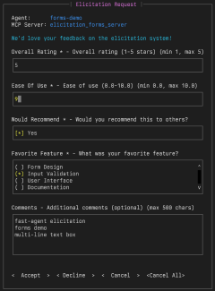
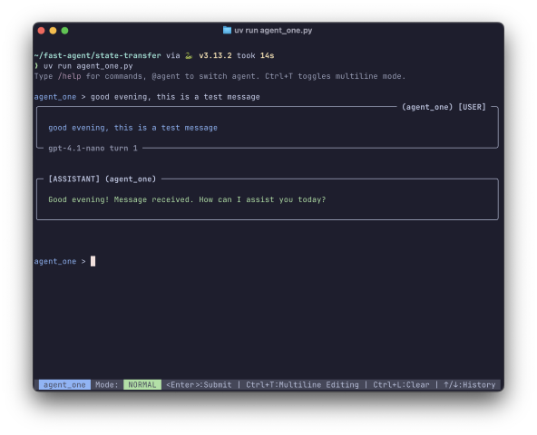

# Quick Start: MCP Elicitations

In this quick start, we'll demonstrate **fast-agent**'s [MCP Elicitation](https://modelcontextprotocol.io/specification/2025-06-18/client/elicitation) features.

{: align=right }

Elicitations allow MCP Servers to request additional information from Users whilst they are running.

The demo comprises an MCP Server that generates Elicitation Requests, and 3 `fast-agent` programs:

 - An interactive demonstration showing different Forms, Fields and Validation.
 - A demonstration of an Elicitation made during a Tool Call.
 - An example of using a custom Elicitation handler.


## Setup **fast-agent**

Make sure you have the `uv` [package manager](https://docs.astral.sh/uv/) installed, and open a terminal window. Then:

=== "Linux/MacOS"

    ```bash
    # create, and change to a new directory
    mkdir fast-agent && cd fast-agent

    # create and activate a python environment
    uv venv
    source .venv/bin/activate

    # setup fast-agent
    uv pip install fast-agent-mcp

    # setup the elicitations demo 
    fast-agent quickstart elicitations

    # go the demo folder
    cd elicitations
    ```
=== "Windows"

    ```pwsh
    # create, and change to a new directory
    md fast-agent |cd

    # create and activate a python environment
    uv venv
    .venv\Scripts\activate

    # setup fast-agent
    uv pip install fast-agent-mcp

    # setup the elicitations demo 
    fast-agent quickstart elicitations

    # go the demo folder
    cd elicitations
    ```

You are now ready to start the demos.

## Interactive Forms

Start the interactive form demo with:

```bash
uv run forms_demo.py
```

This demo causes 4 Elicitation Forms to appear in turn. 

Note that the forms:

 - Can be navigated with the Tab or Arrow Keys (→←)
 - Have real time Validation
 - Can be Cancelled with the Escape key
 - Uses multiline text input for long fields
 - Identify the Agent and MCP Server that produced the request.

The `Cancel All` option cancels the Elicitation Request, and automatically cancels future requests to avoid unwanted interruptions from poorly behaving Servers.

For MCP Server developers, the form is fast to navigate to make iterative testing fast. The `elicitation_forms_server.py` file includes examples of all field types and validations: `Numbers`, `Booleans`, `Enums` and `Strings`.


<!-- 
, rename `fastagent.secrets.yaml.example` to `fastagent.secrets.yaml` and enter the API Keys for the providers you wish to use.  -->

<!-- The supplied `fastagent.config.yaml` file contains a default of `gpt-4o` - edit this if you wish.  -->




## Tool Call


## Custom Handler

Run the Custom Handler demonstration with

```bash
uv run game_character.py
```

This agent uses a custom elicitation handler to generate a character for a game. The custom handler is in `game_character_handler.py` and is setup with the following code:


```python title="game_character.py" linenums="23" hl_lines="4-5"
@fast.agent(
    "character-creator",
    servers=["elicitation_forms_server"],
    # Register our handler from game_character_handler.py
    elicitation_handler=game_character_elicitation_handler,
)
```

## Next Steps

Try modifying the MCP Server to create new forms, or create a Custom Handler.
