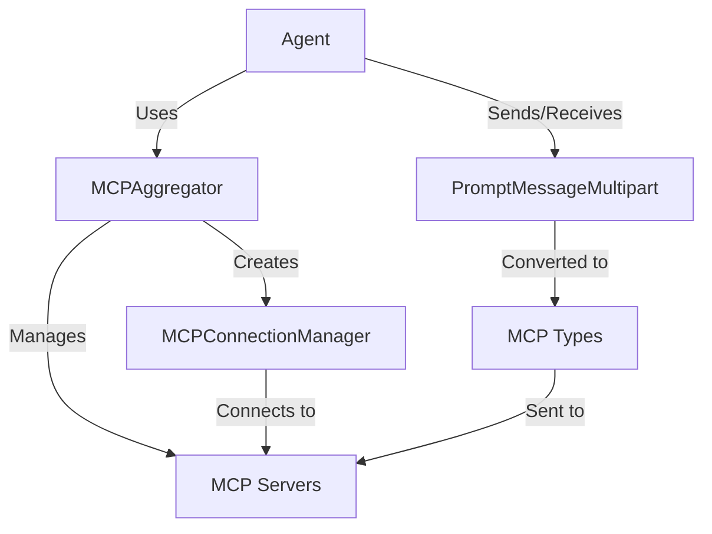

# MCP Integration in FastAgent

FastAgent integrates deeply with the Model Context Protocol (MCP) to provide a powerful, flexible framework for working with language models. This integration allows agents to access various MCP capabilities such as tools, resources, and prompt templates across multiple servers.

## Core MCP Features

FastAgent supports all major MCP features:

- **Tools**: Execute specialized functions on MCP servers
- **Resources**: Access and utilize external data sources
- **Prompts**: Manage and apply reusable prompt templates
- **Sampling**: Generate text completions from language models
- **Instructions**: Use system instructions for guiding model behavior
- **Multi-Server Support**: Connect to and aggregate services from multiple MCP servers

## Architecture

The MCP integration in FastAgent is built around several key components:

- **MCPAggregator**: Manages connections to multiple MCP servers and provides a unified interface
- **MCPConnectionManager**: Handles server connections lifecycle
- **PromptMessageMultipart**: Extended message type that supports multiple content parts
- **Agent Interface**: Provides methods for accessing MCP features through agents

## Core Components

### MCPAggregator

The `MCPAggregator` class serves as a bridge between your agents and multiple MCP servers. It:

- Manages connections to multiple servers
- Discovers and indexes available tools and prompts
- Routes requests to the appropriate server
- Provides unified access to distributed capabilities

### PromptMessageMultipart

The `PromptMessageMultipart` class extends MCP's native message format to support:

- Multiple content parts in a single message
- Mixed content types (text, images, resources)
- Convenient methods for accessing and manipulating content

### MCPConnectionManager

Handles low-level connection management:

- Creates and maintains persistent connections to servers
- Handles reconnection and error recovery
- Manages server lifecycle (startup, shutdown)

## Usage Examples

See the [detailed examples](./examples.md) for more information on how to use MCP features in your agents.