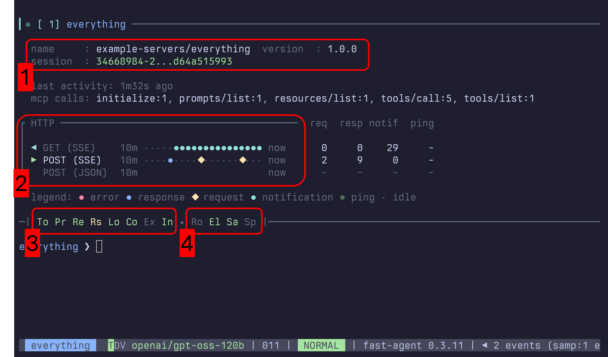

Detailed information about the MCP Server connection can be displayed with the `/mcp` command.

### Section 1 - Implementation and Session

This section shows the MCP Server Implementation Details (`Name` and `Version`), along with any `Mcp-Session-Id` allocated by the MCP Server.

### Section 2 - Transport Channel History

Shows activity from the Streamable HTTP GET and POST handlers for the MCP Server. 

### Section 3 - Server Capabilities

- `To`, `Pr`, `Re`: Tools, Prompts and Resources. Green for available, Yellow for List Change notifications.
- `Rs`: Resource Subscriptions.
- `Lo`, `Co`: Logging and Completions.
- `Ex`: Experimental Capabilities
- `In`: Instructions. Green for available, and used - Yellow for available but not in Prompt, Red for available, but disabled.

### Section 4 - Client Capabilities.

- `Ro`: Roots offered to MCP Server.
- `El`: Elicitation offered to MCP Server. Red for `Cancel All` mode.
- `Sa`: Sampling offered to MCP Server. Green for auto, Yellow for manually configured.
- `Sp`: MCP Client Name has been spoofed.
