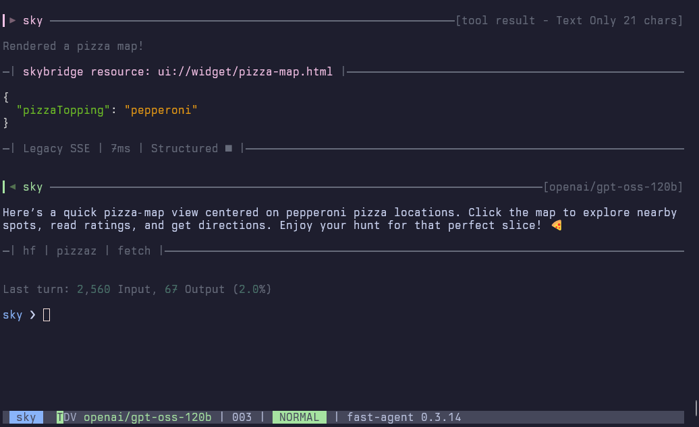

## Overview

**`fast-agent`** automatically detects [OpenAI Apps SDK (Skybridge)](https://developers.openai.com/apps-sdk) integrations exposed by MCP servers. Detection runs during tool/resource discovery: the aggregator looks for tools that publish an `openai/outputTemplate` `_meta` entry and the corresponding `ui://…` resources with the `text/html+skybridge` MIME type. 

## What `fast-agent` checks

- **Template metadata** – verifies that tool `_meta["openai/outputTemplate"]` values are valid URIs. Invalid entries raise warnings so they are easy to spot.
- **Resource availability** – ensures the referenced `ui://` resource exists. Missing resources generate warnings and keep the tool flagged as invalid.
- **MIME-type validation** – confirms the resource exposes `text/html+skybridge`. Non-matching MIME types surface warnings and prevent the tool from being marked as Skybridge-enabled.
- **Unpaired resources** – highlights confirmed Skybridge resources that no tool references, so server authors can wire them up.

All warnings are captured in the `SkybridgeServerConfig.warnings` list, making it straightforward to assert against them in tests or custom diagnostics.

## Console Summary

Right after discovery, the console displays a concise Skybridge summary:

- Lists servers with Skybridge signals, annotating how many enabled tools and valid resources were found.
- Surfaces aggregated warnings (such as invalid MIME types or missing references).
- Provides quick feedback about potential configuration issues before any tool runs.


## Tool Call Display

When a Skybridge-enabled tool returns structured content, the tool result view adds a magenta separator that references the linked `ui://` resource. This makes it clear to developers which HTML payload is expected to render in the OpenAI Apps SDK client.



## Accessing Skybridge Configurations Programmatically

Developers can inspect discovered configurations at runtime:

```python
configs = await agent._aggregator.get_skybridge_configs()
hf_config = await agent._aggregator.get_skybridge_config("huggingface")
```

Each `SkybridgeServerConfig` entry includes resources, tools, and warnings so you can write assertions against servers you are developing.

## Feature Gating / Client Spoofing

Some MCP servers gate Skybridge resources based on the connecting client’s implementation string. If you need to imitate the official Apps SDK, configure Fast Agent’s spoofing settings as described in the [Client Spoofing](./mcp-ui.md#client-spoofing) section. This lets you present a custom `implementation.name`/`version` pair while still benefiting from Skybridge validation and display.
