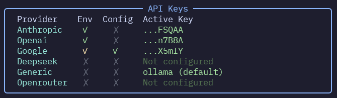

For each model provider, you can configure parameters either through environment variables or in your `fastagent.config.yaml` file.

Be sure to run `fast-agent check` to troubleshoot API Key issues:



## Common Configuration Format

In your `fastagent.config.yaml`:

```yaml
<provider>:
  api_key: "your_api_key" # Override with API_KEY env var
  base_url: "https://api.example.com" # Base URL for API calls
```

## Anthropic

Anthropic models support Text, Vision and PDF content.

**YAML Configuration:**

```yaml
anthropic:
  api_key: "your_anthropic_key" # Required
  base_url: "https://api.anthropic.com/v1" # Default, only include if required
```

**Environment Variables:**

- `ANTHROPIC_API_KEY`: Your Anthropic API key
- `ANTHROPIC_BASE_URL`: Override the API endpoint

**Model Name Aliases:**

| Model Alias | Maps to                    |
| ----------- | -------------------------- |
| `claude`    | `claude-3-7-sonnet-latest` |
| `sonnet`    | `claude-3-7-sonnet-latest` |
| `sonnet35`  | `claude-3-5-sonnet-latest` |
| `sonnet37`  | `claude-3-7-sonnet-latest` |
| `haiku`     | `claude-3-5-haiku-latest`  |
| `haiku3`    | `claude-3-haiku-20240307`  |
| `haiku35`   | `claude-3-5-haiku-latest`  |
| `opus`      | `claude-3-opus-latest`     |
| `opus3`     | `claude-3-opus-latest`     |

## OpenAI

**fast-agent** supports OpenAI `gpt-4.1`, `gpt-4.1-mini`, `o1-preview`, `o1` and `o3-mini` models. Arbitrary model names are supported with `openai.<model_name>`. Supported modalities are model-dependent, check the [OpenAI Models Page](https://platform.openai.com/docs/models) for the latest information.

Structured outputs use the OpenAI API Structured Outputs feature.

Future versions of **fast-agent** will have enhanced model capability handling.

**YAML Configuration:**

```yaml
openai:
  api_key: "your_openai_key" # Default
  base_url: "https://api.openai.com/v1" # Default, only include if required
```

**Environment Variables:**

- `OPENAI_API_KEY`: Your OpenAI API key
- `OPENAI_BASE_URL`: Override the API endpoint

**Model Name Aliases:**

| Model Alias   | Maps to       |
| ------------- | ------------- |
| `gpt-4o`      | `gpt-4o`      |
| `gpt-4o-mini` | `gpt-4o-mini` |
| `gpt-4.1`     | `gpt-4.1`     |
| `gpt-4.1-mini`| `gpt-4.1-mini`|
| `gpt-4.1-nano`| `gpt-4.1-nano`|
| `o1`          | `o1`          |
| `o1-mini`     | `o1-mini`     |
| `o1-preview`  | `o1-preview`  |
| `o3-mini`     | `o3-mini`     |

## DeepSeek

DeepSeek v3 is supported for Text and Tool calling.

**YAML Configuration:**

```yaml
deepseek:
  api_key: "your_deepseek_key"
  base_url: "https://api.deepseek.com/v1"
```

**Environment Variables:**

- `DEEPSEEK_API_KEY`: Your DeepSeek API key
- `DEEPSEEK_BASE_URL`: Override the API endpoint

**Model Name Aliases:**

| Model Alias | Maps to                    |
| ----------- | -------------------------- |
| `deepseek`  | `deepseek-chat` |
| `deepseek3` | `deepseek-chat` |


## Google

Google is currently supported through the OpenAI compatibility endpoint, with first-party support planned soon.

**YAML Configuration:**

```yaml
google:
  api_key: "your_google_key"
  base_url: "https://generativelanguage.googleapis.com/v1beta/openai"
```

**Environment Variables:**

- `GOOGLE_API_KEY`: Your Google API key

**Model Name Aliases:**

_None mapped_

## Generic OpenAI / Ollama


Models prefixed with `generic` will use a generic OpenAI endpoint, with the defaults configured to work with Ollama [OpenAI compatibility](https://github.com/ollama/ollama/blob/main/docs/openai.md). 

This means that to run Llama 3.2 latest you can specify `generic.llama3.2:latest` for the model string, and no further configuration should be required.


!!! warning

    The generic provider is tested for tool calling and structured generation with `qwen2.5:latest` and `llama3.2:latest`. Other models and configurations may not work as expected - use at your own risk.


**YAML Configuration:**

```yaml
generic:
  api_key: "ollama" # Default for Ollama, change as needed
  base_url: "http://localhost:11434/v1" # Default for Ollama
```

**Environment Variables:**

- `GENERIC_API_KEY`: Your API key (defaults to `ollama` for Ollama)
- `GENERIC_BASE_URL`: Override the API endpoint

**Usage with other OpenAI API compatible providers:**
By configuring the `base_url` and appropriate `api_key`, you can connect to any OpenAI API-compatible provider.

## OpenRouter

Uses the [OpenRouter](https://openrouter.ai/) aggregation service. Models are accessed via an OpenAI-compatible API. Supported modalities depend on the specific model chosen on OpenRouter.

Models *must* be specified using the `openrouter.` prefix followed by the full model path from OpenRouter (e.g., `openrouter.google/gemini-flash-1.5`).

**YAML Configuration:**

```yaml
openrouter:
  api_key: "your_openrouter_key" # Required
  base_url: "https://openrouter.ai/api/v1" # Default, only include to override
```

**Environment Variables:**

- `OPENROUTER_API_KEY`: Your OpenRouter API key
- `OPENROUTER_BASE_URL`: Override the API endpoint

**Model Name Aliases:**

OpenRouter does not use aliases in the same way as Anthropic or OpenAI. You must always use the `openrouter.provider/model-name` format.
