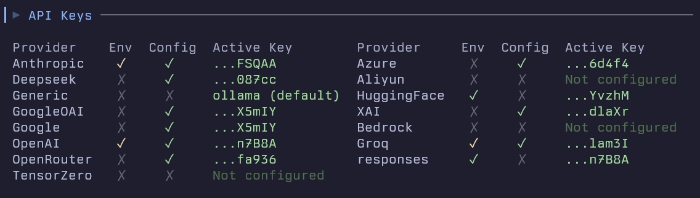

For each model provider, you can configure parameters either through environment variables or in your `fastagent.config.yaml` file.

Be sure to run `fast-agent check` to troubleshoot API Key issues:



## Common Configuration Format

In your `fastagent.config.yaml`:

```yaml
<provider>:
  api_key: "your_api_key" # Override with API_KEY env var
  base_url: "https://api.example.com" # Base URL for API calls
```

## Anthropic

Anthropic models support Text, Vision and PDF content.

**YAML Configuration:**

```yaml
anthropic:
  api_key: "your_anthropic_key" # Required
  base_url: "https://api.anthropic.com/v1" # Default, only include if required
```

**Environment Variables:**

- `ANTHROPIC_API_KEY`: Your Anthropic API key
- `ANTHROPIC_BASE_URL`: Override the API endpoint

**Model Name Aliases:**

| Model Alias | Maps to                    | Model Alias | Maps to                    |
| ----------- | -------------------------- | ----------- | -------------------------- |
| `claude`    | `claude-sonnet-4-0` | `haiku`     | `claude-3-5-haiku-latest`  |
| `sonnet`    | `claude-sonnet-4-0` | `haiku3`    | `claude-3-haiku-20240307`  |
| `sonnet35`  | `claude-3-5-sonnet-latest` | `haiku35`   | `claude-3-5-haiku-latest`  |
| `sonnet37`  | `claude-3-7-sonnet-latest` | `opus`      | `claude-opus-4-0`     |
| `opus3`     |     `claude-3-opus-latest` |      |     |

## OpenAI

**fast-agent** supports OpenAI `gpt-4.1`, `gpt-4.1-mini`, `o1-preview`, `o1` and `o3-mini` models. Arbitrary model names are supported with `openai.<model_name>`. Supported modalities are model-dependent, check the [OpenAI Models Page](https://platform.openai.com/docs/models) for the latest information.

Structured outputs use the OpenAI API Structured Outputs feature.

Future versions of **fast-agent** will have enhanced model capability handling.

**YAML Configuration:**

```yaml
openai:
  api_key: "your_openai_key" # Default
  base_url: "https://api.openai.com/v1" # Default, only include if required
```

**Environment Variables:**

- `OPENAI_API_KEY`: Your OpenAI API key
- `OPENAI_BASE_URL`: Override the API endpoint

**Model Name Aliases:**

| Model Alias   | Maps to       | Model Alias   | Maps to       |
| ------------- | ------------- | ------------- | ------------- |
| `gpt-4o`      | `gpt-4o`      | `gpt-4.1`     | `gpt-4.1`     |
| `gpt-4o-mini` | `gpt-4o-mini` | `gpt-4.1-mini`| `gpt-4.1-mini`|
| `o1`          | `o1`          | `gpt-4.1-nano`| `gpt-4.1-nano`|
| `o1-mini`     | `o1-mini`     | `o1-preview`  | `o1-preview`  |
| `o3-mini`     | `o3-mini`     | `o3`          |               |

## Azure OpenAI

### ⚠️ Check Model and Feature Availability by Region

Before deploying an LLM model in Azure, **always check the official Azure documentation to verify that the required model and capabilities (vision, audio, etc.) are available in your region**. Availability varies by region and by feature. Use the links below to confirm support for your use case:

**Key Capabilities and Official Documentation:**

- **General model list & region availability:**
  [Azure OpenAI Service models – Region availability (Microsoft Learn)](https://learn.microsoft.com/en-us/azure/ai-services/openai/concepts/models?utm_source=chatgpt.com)
- **Vision (GPT-4 Turbo with Vision, GPT-4o, o1, etc.):**
  [How-to: GPT with Vision (Microsoft Learn)](https://learn.microsoft.com/en-us/azure/ai-services/openai/how-to/gpt-with-vision?utm_source=chatgpt.com)
- **Audio / Whisper:**
  [The Whisper model from OpenAI (Microsoft Learn)](https://learn.microsoft.com/en-us/azure/ai-services/speech-service/whisper-overview?utm_source=chatgpt.com)
  [Audio concepts in Azure OpenAI (Microsoft Learn)](https://learn.microsoft.com/en-us/azure/ai-services/openai/concepts/audio?utm_source=chatgpt.com)
- **PDF / Documents:**
  [Azure AI Foundry feature availability across clouds regions (Microsoft Learn)](https://learn.microsoft.com/en-us/azure/ai-foundry/reference/region-support?utm_source=chatgpt.com)

**Summary:**

- **Vision (multimodal):** Models like GPT-4 Turbo with Vision, GPT-4o, o1, etc. are only available in certain regions. In the Azure Portal, the "Model deployments" → "Add deployment" tab lists only those available in your region. See the linked guide for input limits and JSON output.
- **Audio / Whisper:** There are two options: (1) Azure OpenAI (same `/audio/*` routes as OpenAI, limited regions), and (2) Azure AI Speech (more regions, different billing). See the links for region tables.
- **PDF / Documents:** Azure OpenAI does not natively process PDFs. Use [Azure AI Document Intelligence](https://learn.microsoft.com/en-us/azure/ai-services/form-recognizer/) or [Azure AI Search](https://learn.microsoft.com/en-us/azure/search/) for document processing. The AI Foundry table shows where each feature is available.

**Conclusion:** Before deploying, verify that your Azure resource's region supports the required model and features. If not, create the resource in a supported region or wait for general availability.

Azure OpenAI provides all the capabilities of OpenAI models within Azure's secure and compliant cloud environment. fast-agent supports three authentication methods:

1. Using `resource_name` and `api_key` (standard method)
2. Using `base_url` and `api_key` (for custom endpoints or sovereign clouds)
3. Using `base_url` and DefaultAzureCredential (for managed identity, Azure CLI, etc.)

**YAML Configuration:**

```yaml
# Option 1: Standard configuration with resource_name
azure:
  api_key: "your_azure_openai_key" # Required unless using DefaultAzureCredential
  resource_name: "your-resource-name" # Resource name (do NOT include if using base_url)
  azure_deployment: "deployment-name" # Required - the model deployment name
  api_version: "2023-05-15" # Optional, default shown
  # Do NOT include base_url if you use resource_name

# Option 2: Custom endpoint with base_url
azure:
  api_key: "your_azure_openai_key"
  base_url: "https://your-resource-name.openai.azure.com" # Full endpoint URL
  azure_deployment: "deployment-name"
  api_version: "2023-05-15" # Optional
  # Do NOT include resource_name if you use base_url

# Option 3: Using DefaultAzureCredential (requires azure-identity package)
azure:
  use_default_azure_credential: true
  base_url: "https://your-resource-name.openai.azure.com"
  azure_deployment: "deployment-name"
  api_version: "2023-05-15" # Optional
  # Do NOT include api_key or resource_name when using DefaultAzureCredential
```

**Important Configuration Notes:**
- Use either `resource_name` or `base_url`, not both.
- When using `DefaultAzureCredential`, do NOT include `api_key` or `resource_name`.
- When using `base_url`, do NOT include `resource_name`.
- When using `resource_name`, do NOT include `base_url`.

**Environment Variables:**

- `AZURE_OPENAI_API_KEY`: Your Azure OpenAI API key
- `AZURE_OPENAI_ENDPOINT`: Override the API endpoint

**Model Name Format:**

Use `azure.deployment-name` as the model string, where `deployment-name` is the name of your Azure OpenAI deployment.


## Groq

Groq is supported for Structured Outputs and Tool Calling, and has been tested with `moonshotai/kimi-k2-instruct`, `qwen/qwen3-32b` and `deepseek-r1-distill-llama-70b`.

**YAML Configuration:**

```yaml
groq:
  api_key: "your_groq_api_key"
  base_url: "https://api.groq.com/openai/v1"
```

**Environment Variables:**

- `GROQ_API_KEY`: Your Groq API key
- `GROQ_BASE_URL`: Override the API endpoint

**Model Name Aliases:**

| Model Alias | Maps to                    |
| ----------- | -------------------------- |
| `kimi`  | `moonshotai/kimi-k2-instruct` |


## DeepSeek

DeepSeek v3 is supported for Text and Tool calling.

**YAML Configuration:**

```yaml
deepseek:
  api_key: "your_deepseek_key"
  base_url: "https://api.deepseek.com/v1"
```

**Environment Variables:**

- `DEEPSEEK_API_KEY`: Your DeepSeek API key
- `DEEPSEEK_BASE_URL`: Override the API endpoint

**Model Name Aliases:**

| Model Alias | Maps to                    |
| ----------- | -------------------------- |
| `deepseek`  | `deepseek-chat` |
| `deepseek3` | `deepseek-chat` |


## Google

Google is natively supported in `fast-agent` using the Google genai libraries.

**YAML Configuration:**

```yaml
google:
  api_key: "your_google_key"
  base_url: "https://generativelanguage.googleapis.com/v1beta/openai"
```

**Environment Variables:**

- `GOOGLE_API_KEY`: Your Google API key

**Model Name Aliases:**

| Model Alias | Maps to                    |
| ----------- | -------------------------- |
| `gemini2`  | `gemini-2.0-flash` |
| `gemini25` | `gemini-2.5-flash-preview-05-20` |
| `gemini25pro` | `gemini-2.5-pro-preview-05-06` |

### OpenAI Mode

You can also access Google via the OpenAI Provider. Use `googleoai` in the YAML file, or `GOOGLEOAI_API_KEY` for API KEY access.

## XAI Grok

XAI Grok 3 and Grok 4 are available through the XAI Provider.

**YAML Configuration:**

```yaml
xai:
  api_key: "your_xai_key"
  base_url: "https://api.x.ai/v1"
```

**Environment Variables:**

- `XAI_API_KEY`: Your Grok API key
- `XAI_BASE_URL`: Override the API endpoint


## Generic OpenAI / Ollama


Models prefixed with `generic` will use a generic OpenAI endpoint, with the defaults configured to work with Ollama [OpenAI compatibility](https://github.com/ollama/ollama/blob/main/docs/openai.md).

This means that to run Llama 3.2 latest you can specify `generic.llama3.2:latest` for the model string, and no further configuration should be required.


!!! warning

    The generic provider is tested for tool calling and structured generation with `qwen2.5:latest` and `llama3.2:latest`. Other models and configurations may not work as expected - use at your own risk.


**YAML Configuration:**

```yaml
generic:
  api_key: "ollama" # Default for Ollama, change as needed
  base_url: "http://localhost:11434/v1" # Default for Ollama
```

**Environment Variables:**

- `GENERIC_API_KEY`: Your API key (defaults to `ollama` for Ollama)
- `GENERIC_BASE_URL`: Override the API endpoint

**Usage with other OpenAI API compatible providers:**
By configuring the `base_url` and appropriate `api_key`, you can connect to any OpenAI API-compatible provider.

## OpenRouter

Uses the [OpenRouter](https://openrouter.ai/) aggregation service. Models are accessed via an OpenAI-compatible API. Supported modalities depend on the specific model chosen on OpenRouter.

Models *must* be specified using the `openrouter.` prefix followed by the full model path from OpenRouter (e.g., `openrouter.google/gemini-flash-1.5`).

!!! warning

    There is an issue with between OpenRouter and Google Gemini models causing large Tool Call block content to be removed.


**YAML Configuration:**

```yaml
openrouter:
  api_key: "your_openrouter_key" # Required
  base_url: "https://openrouter.ai/api/v1" # Default, only include to override
```

**Environment Variables:**

- `OPENROUTER_API_KEY`: Your OpenRouter API key
- `OPENROUTER_BASE_URL`: Override the API endpoint

**Model Name Aliases:**

OpenRouter does not use aliases in the same way as Anthropic or OpenAI. You must always use the `openrouter.provider/model-name` format.

## TensorZero

[TensorZero](https://tensorzero.com/) is an open-source framework for building production-grade LLM applications.
It unifies an LLM gateway, observability, optimization, evaluations, and experimentation.

At the moment, you must run the TensorZero Gateway as a separate service (e.g. using Docker).
See the [TensorZero Quick Start](https://tensorzero.com/docs/quickstart) and the [TensorZero Gateway Deployment Guide](https://www.tensorzero.com/docs/gateway/deployment/) for more information on how to deploy the TensorZero Gateway.

You can call a function defined in your TensorZero configuration (`tensorzero.toml`) with `fast-agent` by prefixing the function name with `tensorzero.` (e.g. `tensorzero.my_function_name`).

**YAML Configuration:**

```yaml
tensorzero:
  base_url: "http://localhost:3000" # Optional, only include to override
```

**Environment Variables:**

None (model provider credentials should be provided to the TensorZero Gateway instead)

## Aliyun

Tongyi Qianwen is a large-scale language model independently developed by Alibaba Cloud, featuring strong natural language understanding and generation capabilities. It can answer various questions, create written content, express opinions, and write code, playing a role in multiple fields.

**YAML Configuration:**

```yaml
aliyun:
  api_key: "your_aliyun_key"
  base_url: "https://dashscope.aliyuncs.com/compatible-mode/v1"
```

**Environment Variables:**

- `ALIYUN_API_KEY`: Your Aliyun API key
- `ALIYUN_BASE_URL`: Override the API endpoint

**Model Name Aliases:**

Check the [Aliyun Official Documentation](https://help.aliyun.com/zh/model-studio/models) for the latest model names and aliases.

| Model Alias  | Maps to                    |
| ------------ | -------------------------- |
| `qwen-turbo` | `qwen-turbo-2025-02-11`    |
| `qwen-plus`  | `qwq-plus-2025-03-05`      |
| `qwen-max`   | `qwen-max-2024-09-19`      |
| `qwen-long`  | *undocumented*             |
