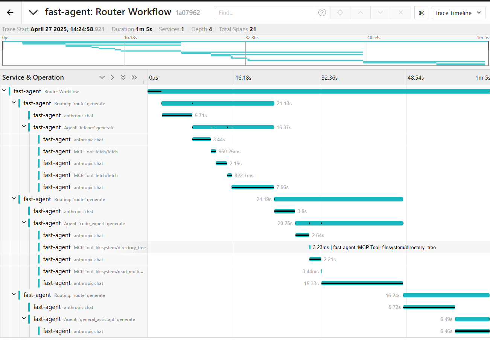

## Getting Started

**fast-agent** supports Open Telemetry, providing observability of MCP and LLM interactions. This is also a useful test/eval tool for comparing the behaviour of MCP Servers with different mixes of Tools, descriptions and models.



## Set up an Open Telemetry server

The first step is to set up an Open Telemetry server. For this example, we will use [Jaeger](https://www.jaegertracing.io/) running locally with `docker-compose.yaml`. Create the following `docker-compose` file in a convenient directory:

```yaml title="docker-compose.yaml"
services:
  jaeger:
    image: jaegertracing/jaeger:latest
    container_name: jaeger
    ports:
      - "16686:16686" # Web UI
      - "4318:4318" # OTLP HTTP

    restart: unless-stopped
```

Run `docker-compose up` to download and start the server. Navigate to `http://localhost:16686` to access the Jaeger UI.

## Configure fast-agent

Next, update your `fastagent.config.yaml` to enable telemetry:

```yaml title="fastagent.config.yaml"
otel:
  enabled: true
  otlp_endpoint: "http://localhost:4318/v1/traces"  # This is the default value
```

Then, run your agent as normal - telemetry is transmitted by default to `http://localhost:4318/v1/traces`. From the Jaeger UI use the "Services" drop down to select **fast-agent** and click "Find Traces" to view the output.

For full configuration settings, check the [configuration file reference](config_file.md#opentelemetry-settings)

